# Analysis of Randomized Sorting Algorithms
## Inspiration

In [a tangential conversation](https://news.ycombinator.com/item?id=12568194) on
Hacker News, [RKoutnik](https://news.ycombinator.com/user?id=RKoutnik) figure out
the problem with using code like `arr.sort(()=>Math.floor(Math.random()*3)-1)`.

Essentially the code above says to randomly sort the array, but does so by randomizing
comparison function. This does not make the output array's order completely random,
the order of the output array will largely depend on which sorting algorithm was used.

Note: The correct way to do this is with [Fisher-Yates Shuffle](https://en.wikipedia.org/wiki/Fisher%E2%80%93Yates_shuffle)


*_Likely to be gone in later edits:_*
When I first read this conversation, I remembered an article I once read that had
a visualization of a similar (possible identical) problem. Failing to find it again
(if you remeber something like this, please tell me), I decided to make my own
visualizations and perhaps try to gain new insight into how various sorting
algorithms work simply through this type of random analysis.

## Warning / Expectations

As can probably be assumed form the title of this post, this post will be about
analysis of sorting algorithms through a non-standard method. As such, the standard
method using Big O notation might be useful to know before reading, but is not
strictly neccessary as this will not contain any references to Big O after this.
However, some familiarity with the various sorting algorithms is almost a neccessity.
The implementation of  each of the algotihms is shown though, so with a quick read
of wikipedia it should be possible to learn enough to follow if you are determined.
If you have taken any introductary CS classes that had a section on sorting algorithms
you should be fine.

Code for all of the sorts will be included because knowing how the exact implementation
details is essential to understanding the graphs we will be using. If you would
prefer to skip the code sections, you should be mostly fine if you don't want a
deep understanding.

## Histogram

*_Likely to be gone in later edits_:*
The visualization I remember and am trying to recreate is a histogram of initial
positions in the array vs final positions in the array.


*_Ignore the secondary histogram below all of the graphs, it will be gone in future versions_*

For example, a histogram of an algorithm that does nothing looks like:


And for a algorithm that reverses the array would look like:


It is fairly easy to generate a histogram (of size `n` by `n`) of a sort with a random comparator using a
function as follows:

```
function hist(n,sort){
  var h = (new Array(n).fill(0)).map(()=>(new Array(n)).fill(0));
  var arr = (new Array(n)).fill(0);
  for(var i = 0; i < 100000; i++){
    arr = arr.map((a,b)=>b);
    sort(arr,()=>Math.floor(Math.random()*3-1))
    for(var k = 0; k < n;k++){
      h[arr[k]][k]++;
    }
  }
  return h;
}
```

And this will be displayed as an image with each pixel (or group of pixels)
representing a element `h[x][y]` and using hue to represent its value.

And thus we can see what Chome's implementation of Array.sort's histogram looks like.

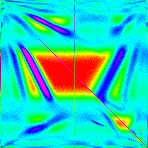

## Array.sort

The main sorting algorithm(s) that started this was Array.sort so it makes sense
to show those histograms first. These will also be the most complicated graphs so
it will show what we will build up to being able to understand.

We will be looking at both the [V8](https://en.wikipedia.org/wiki/V8_(JavaScript_engine))(Chrome)
and [SpiderMonkey](https://en.wikipedia.org/wiki/SpiderMonkey)(Firefox) implementations
of Array.sort

Note: For these tests Chrome is *_Version as of final rendering_*; Firefox is  *_Version as of final rendering_*

Note: for non-built in methods assume Chrome  *_Version as of final rendering_* was used, but it should
not change any results as the javascript sorts should perform the same.


|   n   |     10     |     30     |     50     |     100     |     300     |
|-------|------------|------------|------------|-------------|-------------|
|Chrome ||||||
|Firefox||||||

Note: Varying array lengths `n` are used shown because some of the features of the graph may be clearer at a lower resolution, and for Chrome spefically, `n=10` vs `n=30` are very different graphs.

Based simply on these histograms, can you guess which algorithm Chrome is using?
If you can, that is very impressive; if you can't, it should become more clear
as we continue and look at known algorithms' graphs.

## Simple Sorts

Here the simple sorts: Bubble sort, Insertion Sort and Selection sort will provide
the introduction to matching known sorts to their histograms. These sorts are quite
simple and have relatively easy to understand graphs.

|    n    |     10     |     30     |     50     |     100     |     300     |
|---------|------------|------------|------------|-------------|-------------|
|Bubble   ||||||
|Insertion||||||
|Selection|||||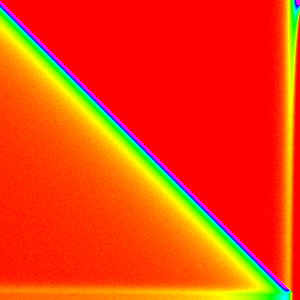|

### [Bubble Sort](https://en.wikipedia.org/wiki/Bubble_sort)

Bubble sort compares and swaps each pair of elements `a[k]` and `a[k+1]` in
successive `n` passes over the array.

The implementation I made was as follows:

```
function bubbleSort(arr,comp){
  for(var i = arr.length-1; i > 0;i--){
    for(var k = 0; k < i; k++){
      if(comp(arr[k],arr[k+1]) > 0){
        let temp = arr[k];
        arr[k]   = arr[k+1];
        arr[k+1] = temp;
      }
    }
  }
}
```

The most striking thing about the graph is that the high points in the graph are
mostly in a line from the top left to the bottom right. This should be expected
because bubble sort will not be changing the order much because the random comparison
is as about as likely to move an element up as down (in the middle of the array).
What is more surprising is that it quite non-symmtric; the the distribution narrows
from the top to the bottom and near the top corner it flairs a little.

The distribution narrowing is due to an optimization that allows bubble sort to
not repeatedly compare the top elements. Because after the `i`th interation the top
`i` elements will be in there final position, this implementation stops when it gets
to that point. As a result, the elements at the top of the array have less of a
chance to move than the bottom ones.

The flairing that is most prominent in the `n=30` graph is mostly due to the bottom
elements getting jumbled many times before they get to settle into there final positions
so they have time to get close to randomly shuffled.

### [Insertion Sort](https://en.wikipedia.org/wiki/Insertion_sort)

Insertion sort sorts by consecutively inserting (perserving sortedness) into `a[0:j]`
(a sorted array by interation `j`).

The implementation I made was as follows:

```
function insertionSort(arr,comp){
  for(var i = 1; i < arr.length;i++){
    for(var k = i; k > 0; k--){
      if(comp(arr[k-1],arr[k]) > 0){
        let temp = arr[k];
        arr[k]   = arr[k-1];
        arr[k-1] = temp;
      }else{
        break;
      }
    }
  }
}
```

Insetion Sort has an incredibly simple graph. Most elements stay close to where
they were initially with a nearly constant deviation. This is because each element
compares with the one just below it and stays in place 2/3 of the time. So each
element has a exponetially decaying by `1/3^d` (where `d` is distance from starting
position for most elements, the edges are slightly more complicated). My display
system is not accurate enough to see when `d > ~5`; so we can only see a slight
change is distribution at the first and last elements.

*_Needs to be reworked, too dismissive:_*
Showing how that edge conditions works will be left as an exercise for the reader
as the math is relatively simple, but too time consuming to detail here.

### [Selection Sort](https://en.wikipedia.org/wiki/Selection_sort)

Selection sorts selects the largest element (by [linear search](https://en.wikipedia.org/wiki/Linear_search))
and swaps it with the `n-i` position for `n` iterations.

The implementation I made was as follows:

```
function selectionSort(arr,comp){
  for(var i = 0; i < arr.length;i++){
    let j = i;
    for(var k = i+1; k < arr.length; k++){
      if(comp(arr[j],arr[k]) > 0){
        j = k;
      }
    }
    let temp = arr[i];
    arr[i]   = arr[j];
    arr[j] = temp;
  }
}
```

Selection Sort is definitely the most interesting of these first three sorting algortihms.
The first element almost always comes from the end of the array, because they are
the last ones considered and thus have a `~1/3` chance of being picked each. Then for
the 0th element is now at the end of the array and is the most likely pick. This
continues down the line until the end of the array was more likely to be picked
than to have this type of pattern hold.

Therfore if we change  `if(comp(arr[j],arr[k]) > 0){` to `if(comp(arr[j],arr[k]) >= 0){`,
then the `~1/3` should change to `~2/3` and the behaviour at the end should sharpen
*_I don't like that word choice_*.

*_Needs to be reworked, figure it out:_*
I have not worked out the math for exactly where the cut off should be for the
tradeoff between those two patterns, and am also unsure on how exactly the pattern
arises aside from what I have stated above. If you think you understand it well
please create an issue on github.

## Complex / Effecient Sorts

Now that we have gotten a taste for what sorting algorithms look like we can move
onto the more advanced sorts: Heap Sort, Merge Sort and Quick Sort. Here is where
we can start to expect to see some similarities to the implementations of Array.sort

|  n  |     10     |     30     |     50     |     100     |     300     |
|-----|------------|------------|------------|-------------|-------------|
|Heap |||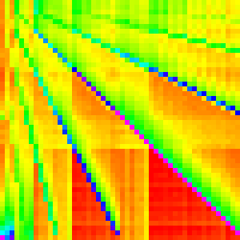|||
|Merge||||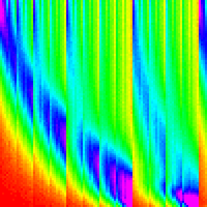||
|Quick||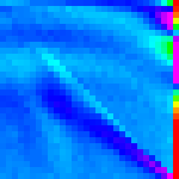||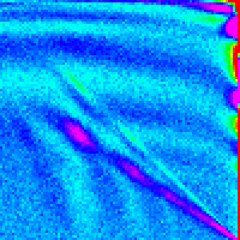||


### [Heap Sort](https://en.wikipedia.org/wiki/Heap_sort)

Heap Sort manipulates the array into a [heap](https://en.wikipedia.org/wiki/Heap_(data_structure))
(generally [in place](https://en.wikipedia.org/wiki/In-place_algorithm) as a
[binary tree](https://en.wikipedia.org/wiki/Binary_tree)). Then the maximum element
is taken out and moved to the end of the unsorted array and the heap is reorganized
to be a heap again.

The implementation I made was as follows *_(TODO: use simplified code in sorts.js)_*:

```
function heapSort(arr,comp){
  heapSortCustom(arr,comp,0,arr.length);
}

function heapSortCustom(arr,comp,start,end){
  heapify(arr, comp, start, end);               // Rearrange Array into a Heap
  for(var i = end-1; i > start;i--){
    let t = arr[i];                             // Move First element to the end
    arr[i] = arr[start];
    arr[start] = t;
    siftDown(arr, comp, start, start, i-1)      // Re-satisfy the heap property
  }
}
function heapify(arr, comp,start,end){
  for(var i = Math.floor(((end-1)+start-1)/2); i >= start; i--){
    siftDown(arr, comp, i, start, end - 1);
  }
}
function siftDown(arr, comp, root, start, end){
  while(2*root + 1 - start <= end){
    let child = 2*root+1-start;
    let tmp = root;

    if(comp(arr[child],arr[tmp])>0){
      tmp = child;
    }
    if(child+1 <= end && comp(arr[child+1],arr[tmp])>0){
      tmp = child + 1;
    }
    if(tmp  == root){
      return;
    }else{
      let t = arr[root];
      arr[root] = arr[tmp];
      arr[tmp] = t;
      root = tmp;
    }
  }
}
```

This is certainly the most complex graph we have seen so far and it is much harder
to analyse as a result.

One way we can get a better understanding of it is by separating it into the `heapify`
part and the for loop part.

|    Heapify    |    Loop    |
|---------------|------------|
|||

*_TODO: would prefer to start with compose up front, maybe in the intro the the new section_*
From this it is quite clear that `heapify` is the cause of the multiple lines and
the loop causes the crosshatching pattern. But how do we know that the Loop image
is an accurate representation of what Heap Sort is doing; the setup to it is commented
out so how can its graph be valid on its own.

We can answer that concern be trying to reassemble the original heap sort from the
peices. We simply need to find out how to compose one graph on top of another.

*_Needs to be reworked, too dismissive:_*
This "compose" operation can just be thought of as a matrix multiplication. The
exact reason why "compose" is a matrix multiplication is not very important or interesting
so it will be left as an exercise for the reader.

As javascript does not have a matrix multiplication built in and I don't want to
bring in a library. I implemented it as:

```
function compose(f,g){
  var n = f.length;
  var out = (new Array(n)).fill(0).map(()=>new Array(n).fill(0));
  for(var x = 0; x < n; x++){
    let h = f[x];
    for(var y = 0; y < n; y++){
      let i = g[y];
      for(var k = 0; k < n;k++){ //rescale i by h[y] and add to out[x]
        out[x][k] += h[y]*i[k];
      }
    }
  }
  return out;
}
```

Using this on the heapified graph and loop graph we find that it is statistically
indistinguishable from the normal Heap Sort graph.

|    Compose(Heapify,Loop)   |    Heap Sort    |
|----------------------------|-----------------|
|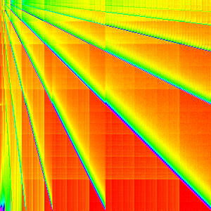||

One important thing to note here is that our "composition" only matches because
we are using a completely random compartor, as long as we don't break any ifs this
is valid. With a normal comparator, it would not be valid because the loop depends
on the values swapped in heapify.

In heapify notice that each line has a line that has twice its slope and half its
slope. If we changed, the binary heap to a ternary heap or some higher [d-ary heap](https://en.wikipedia.org/wiki/D-ary_heap)
I would expect the slopes to correlate because they come from swapping parents
width children.

|  Binary  |  Ternary  |  4-ary  |
|----------|-----------|---------|
|||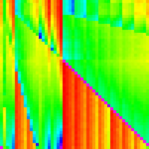|

The loop is a little harder to come to a good understanding of. The pattern on the
left is from moving the first most element to the end of the array in each iteration.
This causes `arr[0]` to always end up in `arr[n-1]`; subsequent iterations are not
that clear cut though because `siftDown` is called.  There are still a few lines
like the ones in heapify, but they are overshadowed by the pattern on the top of
the main line which leads to the crosshatching pattern in the heap sort.

Looking at heap sort as a whole with this new unstanding, may emphasize and explain
the pattern in the bottom left. The exact reason the lines and the crosshatching
patterns arise should also be much clearer.

### [Merge Sort](https://en.wikipedia.org/wiki/Merge_sort)

Merge sort merges (sorted) subarrays until it has merged the entire array.

There are two main ways of implementing merge sort: bottom-up and top-down. Originally
I had implemented it top-down (because its slightly easier that way), but implemented
it bottom-up to use the compose analysis on it (it is easier to separate analysis
with loops rather than recursion) and because it is slightly more efficient (the
browsers were more likely to implement it this way).

My bottom-up implementation I made was as follows:

```
function mergeSort(arr,comp){
  var a1 = arr;
  var a2 = new Array(arr.length)
  for(var w = 1; w < arr.length; w *= 2){
    for(var lo = 0; lo < arr.length; lo += 2*w){
      var hi = lo + w;
      if (hi >= arr.length) {
          copy(a2, a1, lo, arr.length-1);
          break;
      }
      var top = Math.min(lo + 2*w,arr.length);
      merge(a2, a1, lo, hi, top-1, comp);
    }
    var s = a1;
    a1 = a2;
    a2 = s;
  }
  if(a1 !== arr){
    copy(arr,a1,0,arr.length-1);
  }
}

function merge(a1,a2,lo,hi,top,comp){
  var j = hi;
  for(var i = lo; i <= top; i++){
    if(lo >= hi){                  // if the first subarray is empty
      a1[i] = a2[j];
      j++;
    }else if(j > top){            // if the second subarray is empty
      a1[i] = a2[lo];
      lo++;
    }else{
      if(comp(a2[lo],a2[j])>0){  // otherwise compare and move the smaller one
        a1[i] = a2[j];
        j++;
      }else{
        a1[i] = a2[lo];
        lo++;
      }
    }
  }
}

function copy(a1,a2,lo,hi){
  for(var i = lo; i <= hi; i++){
    a1[i] = a2[i];
  }
}
```

Like with heapsort separating the merge sort into discrete steps may give us greater
insight into the workings of the algorithm. Lets just expand `for(var w = 1; w < arr.length; w *= 2){`
and make a graph for each `w`. (This essentially graphing merge with the right parameters)

Note: not all `w`s are shown for sake of space.

|   w   |     1      |      4     |     32    |    128    |
|-------|------------|------------|-----------|-----------|
|mergeStep(w)|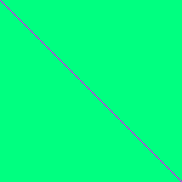||||

These should make sense; each loop is just merging subarrays of length `w` into
subarrays of length `2w`. And each merge looks like the two streaks.

To better understand the merge pattern though, lets look only at the `w=128` graph.
`arr[0]` and `arr[128]` are both likely to end up around `arr[0]` which accounts
for the start of the two streaks. Each element afterwards becomes more uncertain
and more likely to end up towards the end of the array. The vertical cut off of
the first streak is just the boundary between the first subarray and the second.
and the diagonal cutoff for the second is because elements in the second array
cannot be merged behind their initial position because the rest of the second array
needs to fit there.

It is not quite clear how these build the final so lets compose some them in reverse
order to try to better understand (Doing it in forward order will just give us things
that look like merge sort).

IE rather than composing like `((AB)C)D` and looking at each intermediate step. We
can do `A(B(CD))` and look at each itermediate step. This is a valid method because
matrix multiplication is [associative](https://en.wikipedia.org/wiki/Associative_property).

*_TODO: table_*

And that explians why the pattern in merge sort arises just from the graph of merge.


#### Conection to Array.sort
*_Very not happy with this section, may just omit it and leave it for the later section_*

One important thing ot notice is that Merge Sort looks very similar to what Firefox's
implementation looked like. There is a certain "logrithmicness" present in both.
In the Firefox implementation it is more jagged, but it is clear that somehow Firefox
is using merge sort.

|       Merge Sort      |   Array.sort (FireFox)    |
|-----------------------|---------------------------|
|||

### [Quick Sort](https://en.wikipedia.org/wiki/Quick_sort)

Quick sort picks a pivot value (this is the largest differenece between different
quicksort implementations),partitions the array into two sections: elements greater
than the pivot and elements less than pivot, and then quicksorts those subarrays.

The implementation I made was as follows:

```
function quickSort(arr,comp){
  return quickSortRecurse(arr,comp,0,arr.length-1);
}

//quicksort on a slice of the array
function quickSortRecurse(arr,comp,lo,hi){
  if(lo < hi){
    let pivot = partition(arr,comp,lo,hi);
    quickSortRecurse(arr,comp,lo,pivot-1);
    quickSortRecurse(arr,comp,pivot+1,hi);
  }
}

// poor partitioning algorithm for real sorting, I expect the browsers are doing something better/harder
function partition(arr,comp,lo,hi){
  var pivot = arr[hi];
  var k = lo;
  for(var i = lo; i < hi;i++){
    if(comp(arr[i],pivot) < 0){
      let temp = arr[i];
      arr[i]   = arr[k];
      arr[k]   = temp;
      k++;
    }
  }
  arr[hi] = arr[k];
  arr[k]  = pivot;
  return k;
}
```

Quick sort does a pretty good job of being hard to understand. We can't use composition
easily because it is recursive (with dependence on the comparator) and is generally
quite even (there is only one major easy patterns to identify).

The right edge is where we selected the pivot from and is, as a result, different
from the rest. Because of the way it was implemented, where the pivot ended up is
where the first division happened. Looking at the graph, we can see it is most likely
to be around `arr[n/3]` with a pretty smooth distribution to both sides.

That pattern alone I believe is responsible for most of the pattern of the graph.
In each recursive call, the location of the last index changes, but the pattern around
it stays the same.

*_Would prefer a better way to not go into this:_*
A more complex attempt at composition could give a more rigorous and meaningful analysis,
but that would be a somewhat involved process and may not make it any clearer. So for
the sake of time, it will be ommited.

#### Connection to Array.Sort
*_Very not happy with this section, may just omit it and leave it for the later section_*

While it is less clear that Chrome's implementation involves a quicksort, there
is definitely a evenness that is not apparrent in any other major sort, so Chrome
must be using quicksort somehow. If you are unconvinced, don't worry I will have
a more convinving argument as to why Chrome must be using Quick Sort later.

## Figuring out the implementations of Array.Sort

Now that we have a decent understanding of most of the major sorting algorithms,
and how to interpret these graphs we can now begin to try to reverse engineer how
Array.sort was implemented.

### FireFox's Implementation

Just a quick reminder/reference, this is what the graphs for Firefox looked like.

|   n   |     10     |     30     |     50     |     100     |     300     |
|-------|------------|------------|------------|-------------|-------------|
|Firefox||||||

`n=10` shows an interesting pattern along the diagonal. It looks very similar to
insertion sort, but is restricted to 3x3 areas of the graph.

More formally, it looks like it was generated by something like:
```
// Runs Insertion sort on 3 wide sub arrays along the entire array
function boundedInsertionSort(arr,comp){
  for(var i = 0; i < arr.length; i+=3){
    insertCustom(arr,comp,i,1,Math.min(arr.length,i+3));
  }
}

// Also used for other sorts, increment will just be 1 for this.
function insertCustom(arr,comp,start,increment,end){
  for(var i = start+increment; i < end; i+=increment){
    for(var k = i; k - increment >= start; k -= increment){
      if(comp(arr[k-increment],arr[k]) > 0){
        let temp = arr[k];
        arr[k]   = arr[k-increment];
        arr[k-increment] = temp;
      }else{
        break;
      }
    }
  }
}
```

Which looks like


Why would Firefox be using insertion sort like this? Merge Sort can sort just fine
on its own.

While I haven't talked to any contributors about this, I am quite confident it is
because merge sort is inefficient for small lists so insertion sort is taking care
of the small ones then merge sort can take over when the subarrays are greater than
3.

Adding this pre-sorting to a bottom-up mergesort (top down with insertion sort applied
as it is would be super messy) would look like:

```
function mergeInsertSort(arr,comp){
  //apply insertion sort before mergesort
  boundedInsertionSort(arr,comp);
  
  var a1 = arr;
  var a2 = new Array(arr.length)
  
  // w starts are 3 now instead of 1
  for(var w = 3; w < arr.length; w *= 2){
  
    // Everything else is the same
    for(var lo = 0; lo < arr.length; lo += 2*w){
      var hi = lo + w;
      if (hi >= arr.length) {
          copy(a2, a1, lo, arr.length-1);
          break;
      }
      var top = Math.min(lo + 2*w,arr.length);
      merge(a2, a1, lo, hi, top-1, comp);
    }
    var s = a1;
    a1 = a2;
    a2 = s;
  }
  if(a1 !== arr){
    copy(arr,a1,0,arr.length-1);
  }
}
```

Which looks like:

|   n   |     10     |     30     |     50     |     100     |     300     |
|-------|------------|------------|------------|-------------|-------------|
|Merge Insert|||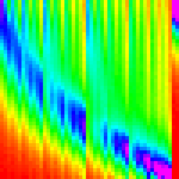||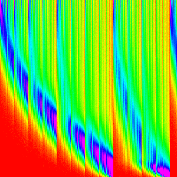|

Which is not right, it is still really close to the default merge sort. We need
something to make merge sort more chunky and let the insertion sort shine through
more.

#### Some Cheating (Looking at the source code)

I can't infer from the graphs what the difference in our implementations is. So
I am going to cheat a little and look at the source code of spider monkey.

Surprisingly, it is quite easy to find the sorting code by looking through the
[source](https://github.com/mozilla/gecko-dev/) on github. Just look at
[jsarray.cpp](https://github.com/mozilla/gecko-dev/blob/master/js/src/jsarray.cpp)
(The obvious place to look for Array methods) and see that [MergeSort](https://github.com/mozilla/gecko-dev/blob/master/js/src/jsarray.cpp#L1753)
is called, but not defined in the file so it must be in one of the headers. [ds/Sort.h](https://github.com/mozilla/gecko-dev/blob/master/js/src/jsarray.cpp#L28)
seems quite promising. In there we find the [definition of MergeSort](https://github.com/mozilla/gecko-dev/blob/master/js/src/ds/Sort.h#L82)
and some [helper methods](https://github.com/mozilla/gecko-dev/blob/master/js/src/ds/Sort.h#L18).

Note: if you don't really care not looking at the source code won't affect anything; it is very similar to the code here.

And looking through, our implementation is strikingly similar to Spidemonkey's (this _may_ not be purely conicidental).
It may be hard to see how the graphs are so different, when the implementations
are so similar.

The one missing thing is [this check](https://github.com/mozilla/gecko-dev/blob/master/js/src/ds/Sort.h#L41):

Note this check simply allows it to be slightly faster than the naive implementation,
it does not affect correctness (assuming that the comparator is transitive
ie ((a > b), (b > c) -> (a > c))) or Big O runtime.

```
if (!lessOrEqual) {
        /* Runs are not already sorted, merge them. */
```


Implementing that check in merge would lead to:

```
function mergeOpt(a1,a2,lo,hi,top,comp){
  var j = hi;
  if(comp(a2[lo],a2[j])>0){
    for(var i = lo; i <= top; i++){
      if(lo >= hi){
        a1[i] = a2[j];
        j++;
      }else if(j > top){
        a1[i] = a2[lo];
        lo++;
      }else{
        if(comp(a2[lo],a2[j])>0){
          a1[i] = a2[j];
          j++;
        }else{
          a1[i] = a2[lo];
          lo++;
        }
      }
    }
  }else{
    copy(a1,a2,lo,top); //not copy(a1,a2,lo,hi) because that would only copy the first sub array
  }
}
```

And when we run the Merge Insert Sort with this extra check,

|   n   |     10     |     30     |     50     |     100     |     300     |
|-------|------------|------------|------------|-------------|-------------|
|Merge Insert with Extra Check||||||

Which is nearly identical. Success!

And we only had to cheat a little. We were able to guess most of the implementation
through this type of analysis, but it wasn't immediately clear how to implement
the last major difference. We could at least confirm if our implementation was nearly
identical though.

### Chrome's implementation

Reminder of the Graphs

|   n   |     10     |     30     |     50     |     100     |     300     |
|-------|------------|------------|------------|-------------|-------------|
|Chrome ||||||

#### Verification that QuickSort is involved

One thing that may have seemed specualtive in earlier analysis is that chrome has
to somehow use Quick Sort.

We can at least somewhat confirm this by showing that Chrome's Array.sort in [unstable](https://en.wikipedia.org/wiki/Sorting_algorithm#Stability).

We can't prove stability without testing all possible inputs (_Some proof for this_),
but we can show unstability. The following test fails for chrome.

```
var a = [[5,1],[5,2],[4,3],[4,4],[3,5],[3,6],[2,7],[2,8],[1,9],[1,10]];
a.sort((a,b)=>a[0]=b[0]);

// a is now [[1,10],[1,9],[1,8],[1,7],[1,6],[1,5],[1,4],[1,3],[1,2],[1,1]]
```

`[1,10]` and `[1,9]` swapped places and thus we know that it is not stable so, of
effecient, pure algorithms, only heap sort and quick sort are unstable. As it should
be clear Array.sort is not using heapsort for the top level sorting algorithm, quick
sort must be the major algorithm in the implementation.

#### Insertion sort is involved

For `n=10` we can see that it is very similar if not indentical to insertion Sort.

A quick test can show a comparison of Array.sort and insertion Sort around 10.

|   n   |     5     |     10     |     12     |     15     |
|-------|-----------|------------|------------|------------|
|Chrome |||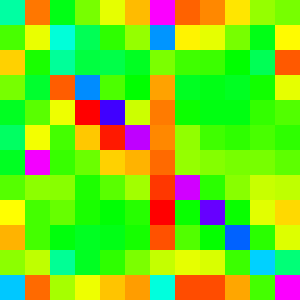|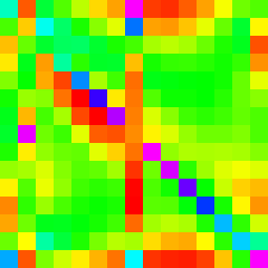|
|Insertion|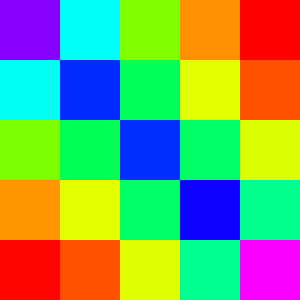|||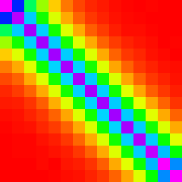|

As we can see, for `n=5` and `n=10`, Array.sort looks indistinguishable from insertion
sort. But for `n=12` and `n=15`, the patterns diverge. We can conclude from this that,
at least for first iteration (my guess is that its true for every iteration), if
`n <= 10`, insertion sort is being used instead of Quick Sort.

#### Partitioning algorithm

In the graphs of Array.sort, the first, middle and last elements all have a vertical line associated with them in the graph. So we can guess that the pivot value is chosen somehow from one of those three elements.

IE, the partition function is probably something like

```
function partition(arr,comp,lo,hi){
  // f is some unknown function
  var s = f(arr,lo,(lo+hi)/2), hi);
  
  var pivot = arr[s]; //move the pivot to the top
  arr[s] = arr[hi];
  arr[hi] = s;
  
  //same as old partition
  var k = lo;
  for(var i = lo; i < hi;i++){
    if(comp(arr[i],pivot) < 0){
      let temp = arr[i];
      arr[i]   = arr[k];
      arr[k]   = temp;
      k++;
    }
  }
  
  arr[hi] = arr[k];
  arr[k]  = pivot;
  return k;
}
```

My best guess for what the function f would be is picking the middle value. EG

```
function f(arr,lo,mid,hi){
  // select the middle element when sorted by value of the array
  return [lo,mid,hi].sort((a,b)=>arr[a]-arr[b])[1];
}
```


#### Best guess for Chrome's implementation

Combining all of the hints we have extracted thus far, we can get that chrome's
implementation is something like:

```
function quickInsertSort(arr,comp){
  return quickInsertSortRecurse(arr,comp,0,arr.length-1);
}

function quickInsertSortRecurse(arr,comp,lo,hi){
  if(lo + 10 < hi){
    let pivot = partition3(arr,comp,lo,hi);
    quickInsertSortRecurse(arr,comp,lo,pivot-1);
    quickInsertSortRecurse(arr,comp,pivot+1,hi);
  }else{
    insertCustom(arr,comp,lo,1,hi+1);
  }
}

function partition3(arr,comp,lo,hi){
  var pivot = setupPivot(arr,comp,lo,Math.floor((lo+hi)/2), hi);
  
  var k = lo+1;
  for(var i = lo+1; i < hi-1;i++){
    if(comp(arr[i],pivot) < 0){
      let temp = arr[i];
      arr[i]   = arr[k];
      arr[k]   = temp;
      k++;
    }
  }
  arr[hi-1] = arr[k];
  arr[k]  = pivot;
  return k;
}

function setupPivot(arr,comp,lo,mid,hi){
  var a = arr[lo];
  var b = arr[mid];
  var c = arr[hi];
  if(comp(a,b) > 0){
    let t = a;
    a = b;
    b = c;
  }
  if(comp(a,c) >= 0){
    let t = a;
    a = c;
    c = b;
    b = t;
  }else{
    if (comp(b, c)) {
      let t = b;
      b = c;
      c = t;
    }
  }
  arr[lo] = a;
  arr[hi] = c
  
  arr[mid] = arr[hi-1];
  arr[hi-1] = b;
  
  return b;
}
```

This doesn't quite follow the things I laid above for a few reasons:
  1. I don't want to be using `[].sort` in my implementation so I inlined that
  2. For simplicity, I changed `f` to put the pivot on top and just return the pivot
  3. Optimized a little by placing the non-pivot values on the right side of the pivot and did not include them in the main partition.

This algorithm looks like:

|   n   |     10     |     30     |     50     |     100     |     300     |
|-------|------------|------------|------------|-------------|-------------|
|Quick Insert + new Partition|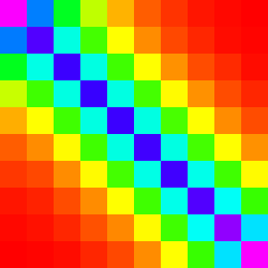||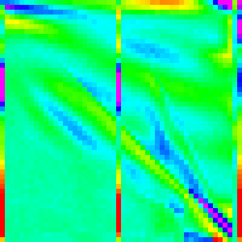|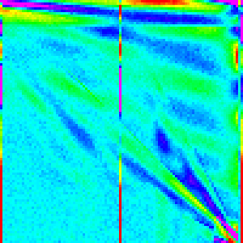||

Ok, that is definitely much closer than a pure quicksort. For `n=10` we get the
insertion Sort as expected and we know do have those vertical lines at the bottom,
midpoint and top. However, we are still missing something, the big red spot in the
middle of the Array.sort graph is completely absent in this one.

Though, we can at least deduce on more thing about Chrome's implementation. Note
the double bar in our algorithm on the right vs the double bar on the left in Chrome's
implementation.

|   Quick Insert Sort   |         Array.sort         |
|-----------------------|----------------------------|
|||

So we know that chrome is partitioning putting the pivot on the bottom rather than
the top. Changing that doesn't make a significant difference though.

Like with Firefox's Implementation, it looks like its not trivial to guess how to
make our current guess better.

#### Some more Cheating

Like with FireFox's source, [v8's source](https://github.com/v8/v8/) is also on
Github. Then looking in the most obvious file [array.js](https://github.com/v8/v8/blob/master/src/js/array.js),
we find [InnerArraySort](https://github.com/v8/v8/blob/master/src/js/array.js#L710)
which implements Array.sort. There are a bunch of extra checks in that function,
but we only really care about up till [line 844](https://github.com/v8/v8/blob/master/src/js/array.js#L844).
Disregarding [GetThirdIndex](https://github.com/v8/v8/blob/master/src/js/array.js#L742)
and some checks, we have effectively identical code up to [line 804](https://github.com/v8/v8/blob/master/src/js/array.js#L804).

Note that:

```
while (true) {
  // Insertion sort is faster for short arrays.
  if (to - from <= 10) {
    InsertionSort(a, from, to);
    return;
  }
  
  //...
  //...
  
  
  if (to - high_start < low_end - from) {
    QuickSort(a, high_start, to);
    to = low_end;
  } else {
    QuickSort(a, from, low_end);
    from = high_start;
  }
}
```

is essentially just inlining the [tail call](https://en.wikipedia.org/wiki/Tail_call) of

```
function quickInsertSortRecurse(arr,comp,lo,hi){
  if(lo + 10 < hi){
    let pivot = partition3(arr,comp,lo,hi);
    quickInsertSortRecurse(arr,comp,lo,pivot-1);
    quickInsertSortRecurse(arr,comp,pivot+1,hi);
  }else{
    insertCustom(arr,comp,lo,1,hi+1);
  }
}
```

The main difference is in the partitioning step (which is the meat of Quick Sort).
Chrome is using a more complex partition (which is somewhat hard to understand due
to optimizations) which is partitions the array into three peices (less than pivot,
equal to pivot, and greater than pivot); ours simply partitions into two (less than,
and greater than or equal to).

Reworking our partitition (and recurse method) to account like the following should
give us a very similar graph to Chrome's implementation.

```
function quickInsertSort2Recurse(arr,comp,lo,hi){
  if(lo + 10 < hi){
    let [a,b] = partition3(arr,comp,lo,hi);
    quickInsertSort2Recurse(arr,comp,lo,a-1);
    quickInsertSort2Recurse(arr,comp,b+1,hi);
  }else{
    insertCustom(arr,comp,lo,1,hi+1);
  }
}

function partition3(arr,comp,lo,hi){
  var pivot = setupPivot(arr,comp,lo,Math.floor((lo+hi)/2), hi);
  
  var eqlo = lo+1, eqhi = hi-1;
  for(let i = lo+2; i <= eqhi;i++){
    var c = comp(arr[i],pivot);
    if(c < 0){
      // move arr[i] below the equal range
      let t = arr[eqlo];
      arr[eqlo] = arr[i];
      arr[i] = t;
      eqlo++;
    }else if(c > 0){
      // move arr[i] above the equal range
      let t = arr[eqhi];
      arr[eqhi] = arr[i];
      arr[i] = t;
      eqhi--;
      i--; //the value at arr[i] has not yet been processed so stall the loop
    } // if c === 0, do nothing, it is in the right place
  }
  // state of sub array:
  //  [lo,eqlo) is less than pivot
  //  [eqlo,eqhi] is equal to pivot
  //  (eqhi,hi) is greater than pivot
  return [eqlo,eqhi];
}
```
 
|   n   |     10     |     30     |     50     |     100     |     300     |
|-------|------------|------------|------------|-------------|-------------|
|Quick Insert + new new Partition||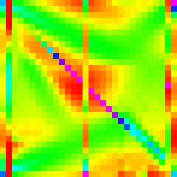|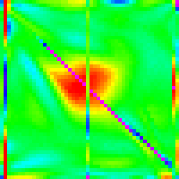|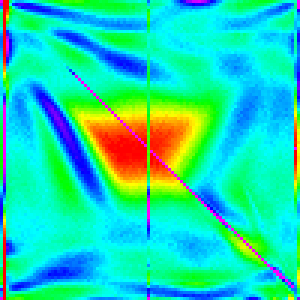||

And it does. Success.

One question that this raises though is how much does insertion sort play a role in defining the shape of the graph

Interesting aside:

Changing the cutoff for using insertion sort can perhaps help us understand why this patterns occurs.

|   n   |     20     |     30     |     40     |     50     |
|-------|------------|------------|------------|------------|
||||||

## Final Words

By using a random compartor we were able to see into the black box of Array.sort
implementation and do a decent job of reverse engineering. This technique has many
parallels to [Fuzz Testing](https://en.wikipedia.org/wiki/Fuzz_testing); the main
diferrence is that we are not trying to make the software error and instead are
seeing what the undefined behaviour looks like. By comparing to known algorithms,
we can get most of the way to understanding what is happening inside the black box.
Getting to an exact match of the implementation may be hard to do, but if achieved
through some separate method. This method can validate much of the behaviour of the
reproduced algorithm.

On a slightly different note, this method also allows us to "see" logical equivilances.
Two methods that may have very similar code, but a slight difference such as an extra
if, might generate very different graphs.

Hints for applying this type of technique to other types of problems:
  - Find undefined behaviour that would differentiate algorithms
    - All sorting algorithms give the same final result (disragarding stability) if the compartor fufills a few comnditions (reflexive, antisymmtric, transitive)
    - Randomness abuses all three and thus the output is undefined
  - Find a way to visualize or aggregate the data
  - Implement several algorithms and test them to understand patterns

### Next Steps

Some possible ways to build off this:
  - Try using a different random comparator eg make it change the probabilities of 1 -1 and 0
  - Try testing other sort implementations such as Opera's and Edge/IE's
    - A PR for this would be welcomed
  - Try having the comparator only sometimes be random
  

## Appendix: More Hybrid Sorts
Here are a few more sorts I implemented, but didn't fit well into the flow of the
general article (made it too long). However they interesting (and pretty) so I will
include them here. Analysis will be foregone for sake of space and my time.

As this is on Github, if you feel like adding an interesting hybrid sort here, feel
free to make a Pull request to add it.

### Shell Sort
### Comb Sort
### Cocktail Shaker Sort
