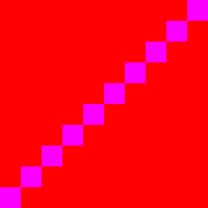
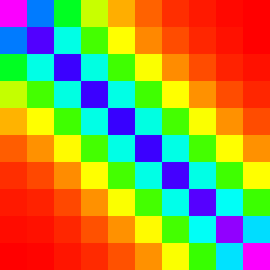
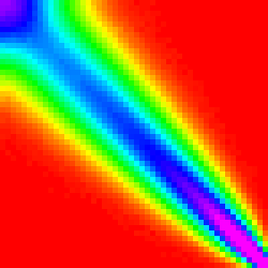
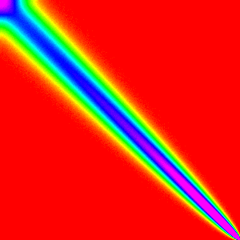
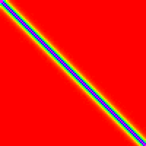
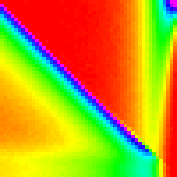
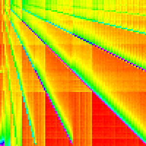
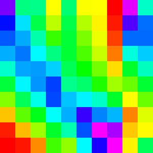
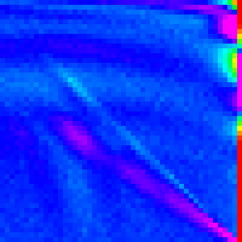

# Analysis of Randomized Sorting Algorithms
## Inspiration

In [a tangential conversation](https://news.ycombinator.com/item?id=12568194) on
Hacker News, RKoutnik figure out the problem with using code like
`arr.sort(()=>Math.floor(Math.random()*3)-1)`.

Essentially the code above says to randomly sort the array, but does so by randomizing
comparison function. This does not make the output array's order completely random,
the order of the output array will largely depend on which sorting algorithm was used.

Note: The correct way to do this is with [Fisher-Yates Shuffle](https://en.wikipedia.org/wiki/Fisher%E2%80%93Yates_shuffle)

When I first read this conversation, I remembered an article I once read that had
a visualization of a similar (possible identical) problem. Failing to find it again
(if you remeber something like this, please tell me), I decided to make my own
visualizations and perhaps try to gain new insight into how various sorting
algorithms work simply through this type of random analysis.

## Warning / Expectations

As can probably be assumed form the title of this post, this post will be about
analysis of sorting algorithms through a different method. As such, the standard
method using Big O notation would be useful to know before reading, but is not
strictly neccessary as this will not contain any references to Big O after this.
However, some familiarity with the various sorting algorithms is almost a neccessity.
The implementation of  each of the algotihms is shown though, so with a quick read
of wikipedia it should be possible to know plenty of the analysis on your own.

If you have taken any introductary CS classes that had a section on sorting algorithms
you should be fine.

## Histogram

The visualization I remember and am trying to recreate is a histogram of initial
positions in the array vs final positions in the array.

For example, a histogram of an algorithm that does nothing looks like:


And for a algorithm that reverses the array would look like:



We can then write a function to run a random sort n times as follows:

```
function hist(n,sort){
  var h = (new Array(n).fill(0)).map(()=>(new Array(n)).fill(0));
  var arr = (new Array(n)).fill(0);
  for(var i = 0; i < 100000; i++){
    arr = arr.map((a,b)=>b);
    sort(arr,()=>Math.floor(Math.random()*3-1))
    for(var k = 0; k < n;k++){
      h[arr[k]][k]++;
    }
  }
  return h;
}
```

And this will be displayed as an image with each pixel (or group of pixels)
representing a element `h[x][y]` and using hue to represent its value.

And thus we can see what Chome's implementation of Array.sort's histogram looks like.

_Perhaps something about the secondary historgram in on the bottom if it stays in_


## Array.sort

The main sorting algorithm(s) that started this was Array.sort so it makes sense
to show those histograms first. These will also be the most complicated graphs so
it will show what we will build up to being able to understand.

We will be looking at both the V8(Chrome/Webkit) and SpiderMonkey(Firefox) implementations
of Array.sort

Note: For these tests Chrome is _Version_; Firefox is _Version_

Note: for non-built in methods assume Chrome _Version_ was used, but it should
not change any results as the javascript sorts should perform the same.


|   n   |     10     |     30     |     50     |     100     |     300     |
|-------|------------|------------|------------|-------------|-------------|
|Chrome ||||||
|Firefox||||||

Note: Varying array lengths (n) are used shown because some of the features of the graph may be clearer at a lower resolution. Also for Chrome `n=10` vs `n=30` are very different graphs.

Based simply on these histograms, can you guess which algorithm Chrome is using?
If you can, that is very impressive; if you can't, it should become more clear
as we continue and look at other algorithms.

## Simple Sorts

Here the simple sorts: Bubble sort, Insertion Sort and Selection sorts will provide
the introduction to matching known sorts to their histograms. These sorts are quite
simple and have relatively easy to understand graphs.

|    n    |     10     |     30     |     50     |     100     |     300     |
|---------|------------|------------|------------|-------------|-------------|
|Bubble   ||||||
|Insertion||||||
|Selection||||||

### Bubble Sort

If you are unfamiliar with [Bubble Sort](https://en.wikipedia.org/wiki/Bubble_sort),
the TLDR is each pair of elements `a[j]` and `a[j+1]` are compared and swapped in
successive `n` passes over the array.

The implementation I made was as follows:

```
function bubbleSort(arr,comp){
  for(var i = arr.length-1; i > 0;i--){
    for(var k = 0; k < i; k++){
      if(comp(arr[k],arr[k+1]) > 0){
        let temp = arr[k];
        arr[k]   = arr[k+1];
        arr[k+1] = temp;
      }
    }
  }
}
```

The most striking thing about the graph is that the high points in the graph are
mostly in a line from the top left to the bottom right. This should be expected
because insertion sort will not be changing the order much because the random comparison
is as about as likely to move an element up as down. That is more surprising is
that it quite non-symmtric; the the distribution narrows from the top to the bottom
and near the top corner it flairs a little.

The distribution narrowing is due to an optimization that allows bubble sort to
not repeatedly compare the top elements. Because after `n` interation the top `n`
elements will be sorted, bubble sort stops earlier than the end of the list. As a
result, the elements at the top of the array have less of a chance to move than the
bottom ones.

The flairing is a little more complicated, so I will leave it for later analysis.
_maybe continue with this_

### Insertion Sort

If you are unfamiliar with [Insertion Sort](https://en.wikipedia.org/wiki/Insertion_sort),
the TLDR is that elements are sorted by consecutive insertion (perserving sortedness)
into `a[0:j]` (a sorted array by interation `j`).

The implementation I made was as follows:

```
function insertionSort(arr,comp){
  for(var i = 1; i < arr.length;i++){
    for(var k = i; k > 0; k--){
      if(comp(arr[k-1],arr[k]) > 0){
        let temp = arr[k];
        arr[k]   = arr[k-1];
        arr[k-1] = temp;
      }else{
        break;
      }
    }
  }
}
```

Insetion Sort has an incredibly simple graph. Most elements stay close to where
they were initially with a nearly constant deviation. This is because each element
compares with the one just below it and stays in place 2/3 of the time. So each
element has a exponetially decaying by `1/3*d` (where `d` is distance from starting
position if we don't consider the left and right bounds on the array). My display
system is not accurate enough to see when `d > ~5`; so we can only see a slight
change is distribution at the first and last elements.

Showing how that edge conditions works will be left as an exercise for the reader
as the math is relatively simple, but too time consuming to write more about here.

### Selection Sort

If you are unfamiliar with [Selection Sort](https://en.wikipedia.org/wiki/Selection_sort),
the TLDR is that the largest element is selected (looking from bottom to top) and
moved to the end of the array.

The implementation I made was as follows:

```
function selectionSort(arr,comp){
  for(var i = 0; i < arr.length;i++){
    let j = i;
    for(var k = i+1; k < arr.length; k++){
      if(comp(arr[j],arr[k]) > 0){
        j = k;
      }
    }
    let temp = arr[i];
    arr[i]   = arr[j];
    arr[j] = temp;
  }
}
```

Selection Sort is definitely the most interesting of these first three sorting algortihms.
The first element almost always comes from the end of the array, because they are
the last ones considered and thus have a `~1/3` chance of being picked each. Then for
the 0th element is now at the end of the array and is the most likely pick. This
continues down the line until the end of the array was more likely to be picked
than to have this type of pattern hold.

I have not worked out the math for exactly where the cut off should be for the
tradeoff between those two patterns, and am also unsure on how exactly the pattern
arises aside from what I have stated above. If you think you understand it well
please create an issue on github.

## Complex / Effecient Sorts

Now that we have gotten a taste for what sorting algorithms look like we can move
onto the more advanced sorts: Heap Sort, Merge Sort and Quick Sort. Here is where
we can start to expect to see some similarities to the implementations of Array.sort

|  n  |     10     |     30     |     50     |     100     |     300     |
|-----|------------|------------|------------|-------------|-------------|
|Heap ||||||
|Merge||||||
|Quick||||||


### Heap Sort

If you are unfamiliar with [Heap Sort](https://en.wikipedia.org/wiki/Heap_sort),
the TLDR is that the array is manipulated into a [heap](https://en.wikipedia.org/wiki/Heap_(data_structure))
(generally [in place](https://en.wikipedia.org/wiki/In-place_algorithm) as a
[binary tree](https://en.wikipedia.org/wiki/Binary_tree)). Then the maximum element
is taken out and moved to the end of the unsorted array and the heap is reorganized
to be a heap again.

The implementation I made was as follows:

```
function heapSort(arr,comp){
  heapSortCustom(arr,comp,0,arr.length);
}

function heapSortCustom(arr,comp,start,end){
  heapify(arr, comp, start, end);               // Rearrange Array into a Heap
  for(var i = end-1; i > start;i--){
    let t = arr[i];                             // Move First element to the end
    arr[i] = arr[start];
    arr[start] = t;
    siftDown(arr, comp, start, start, i-1)      // Re-satisfy the heap property
  }
}
function heapify(arr, comp,start,end){
  for(var i = Math.floor(((end-1)+start-1)/2); i >= start; i--){
    siftDown(arr, comp, i, start, end - 1);
  }
}
function siftDown(arr, comp, root, start, end){
  while(2*root + 1 - start <= end){
    let child = 2*root+1-start;
    let tmp = root;

    if(comp(arr[child],arr[tmp])>0){
      tmp = child;
    }
    if(child+1 <= end && comp(arr[child+1],arr[tmp])>0){
      tmp = child + 1;
    }
    if(tmp  == root){
      return;
    }else{
      let t = arr[root];
      arr[root] = arr[tmp];
      arr[tmp] = t;
      root = tmp;
    }
  }
}
```

This is certainly the most complex graph we have seen so far and it is much harder
to analyse as a result.

One way we can get a better understanding of it is by separating it into the `heapify`
part and the for loop part.

|    Heapify    |    Loop    |
|---------------|------------|
|||

From this it is quite clear that `heapify` is the cause of the multiple lines and
the loop fills in the graph. But how do we know that the Loop image is an accurate
representation of what Heap Sort is doing; the setup to it is commented out so how
can its graph be valid on its own.

We can answer that concern be trying to reassemble the original heap sort from the
peices. We simply need to find out how to compose one graph on top of another.

This "compose" operation can just be thought of as a matrix multiplication. The
exact reason why "compose" is a matrix multiplication is not very important or interesting
so it will be left as an exercise for the reader.

As javascript does not have a matrix multiplication built in and I don't want to
bring in a library. I implemented it as:
```
function compose(f,g){
  var n = f.length;
  var out = (new Array(n)).fill(0).map(()=>new Array(n).fill(0));
  for(var x = 0; x < n; x++){
    let h = f[x];
    for(var y = 0; y < n; y++){
      let i = g[y];
      for(var k = 0; k < n;k++){ //rescale i by h[y] and add to out[x]
        out[x][k] += h[y]*i[k];
      }
    }
  }
  return out;
}
```

Using this on the heapified graph and loop graph we find that it is statistically
indistinguishable from the normal Heap Sort graph.

|    Compose(Heapify,Loop)   |    Heap Sort    |
|----------------------------|-----------------|
|||

_Analysis of Heapify_

_Analysis of the Loop_


### Merge Sort

If you are unfamiliar with [Merge Sort](https://en.wikipedia.org/wiki/Merge_sort),
the TLDR is that it merges (sorted) subarrays until it has merged the entire array.

There are two main ways of implementing merge sort: bottom-up and top-down. Originally
I had implemented it top-down (because its slightly easier that way), but implemented
it bottom-up to use the compose analysis on it (it is easier to separate analysis
with loops and because it is slightly more efficient, the browsers were more likely
to implement it this way).

My bottom-up implementation I made was as follows:

```
function mergeSort(arr,comp){
  var a1 = arr;
  var a2 = new Array(arr.length)
  for(var w = 3; w < arr.length; w *= 2){
    for(var lo = 0; lo < arr.length; lo += 2*w){
      var hi = lo + w;
      if (hi >= arr.length) {
          copy(a2, a1, lo, arr.length-1);
          break;
      }
      var top = Math.min(lo + 2*w,arr.length);
      merge(a2, a1, lo, hi, top-1, comp);
    }
    var s = a1;
    a1 = a2;
    a2 = s;
  }
  if(a1 !== arr){
    copy(arr,a1,0,arr.length-1);
  }
}

function merge(a1,a2,lo,hi,top,comp){
  var j = hi;
  for(var i = lo; i <= top; i++){
    if(lo >= hi){                  // if the first subarray is empty
      a1[i] = a2[j];
      j++;
    }else if(j > top){            // if the second subarray is empty
      a1[i] = a2[lo];
      lo++;
    }else{
      if(comp(a2[lo],a2[j])>0){  // otherwise compare and move the smaller one
        a1[i] = a2[j];
        j++;
      }else{
        a1[i] = a2[lo];
        lo++;
      }
    }
  }
}

function copy(a1,a2,lo,hi){
  for(var i = lo; i <= hi; i++){
    a1[i] = a2[i];
  }
}
```

_Full analysis of MergeSort_

### Quick Sort

If you are unfamiliar with [Quick Sort](https://en.wikipedia.org/wiki/Quick_sort),
the TLDR is that it picks a pivot value (this is the largest differenece between
different quicksort implementations) and moves all smaller elments to the left of
it and all larger ones to the right then recurses on those two smaller arrays.

The implementation I made was as follows:

```
function quickSort(arr,comp){
  return quickSortRecurse(arr,comp,0,arr.length-1);
}

//quicksort on a slice of the array
function quickSortRecurse(arr,comp,lo,hi){
  if(lo < hi){
    let pivot = partition(arr,comp,lo,hi);
    quickSortRecurse(arr,comp,lo,pivot-1);
    quickSortRecurse(arr,comp,pivot+1,hi);
  }
}

// poor partitioning algorithm for real sorting, I expect the browsers are doing something better/harder
function partition(arr,comp,lo,hi){
  var pivot = arr[hi];
  var k = lo;
  for(var i = lo; i < hi;i++){
    if(comp(arr[i],pivot) < 0){
      let temp = arr[i];
      arr[i]   = arr[k];
      arr[k]   = temp;
      k++;
    }
  }
  arr[hi] = arr[k];
  arr[k]  = pivot;
  return k;
}
```
_Analysis of Quick Sort_